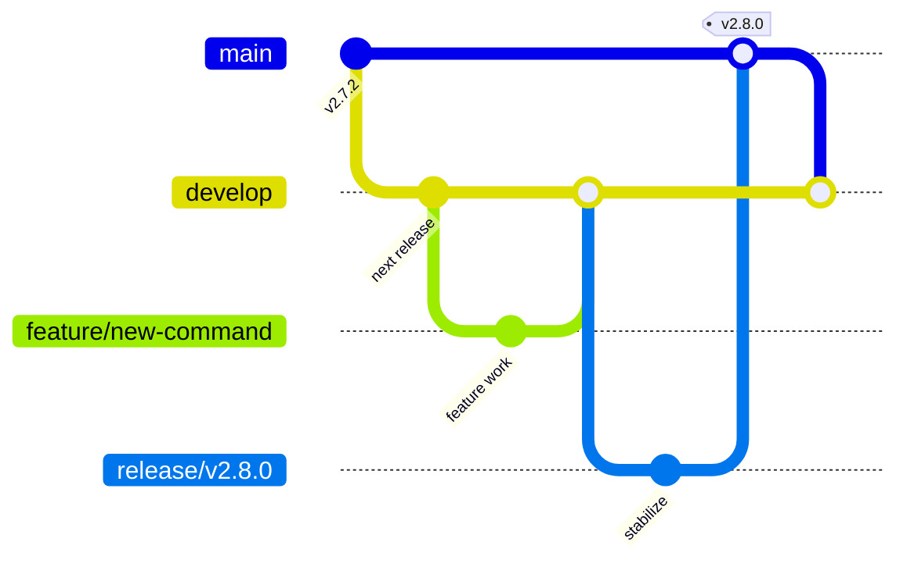

import { Steps, Tabs, TabItem, Aside } from '@astrojs/starlight/components';

`sj` uses a Git Flow-style branching model. Feature and fix work lands on
`develop`; a release is prepared on a dedicated `release/*` branch and ships
when that branch is merged into `main`. Urgent production fixes follow the same
path from a `hotfix/*` branch cut from `main`.

The version is selected in the release or hotfix branch name. Do not edit a
version constant or create the normal release tag by hand: the repository
automation derives the tag, publishes the release, and stamps the version into
the release binaries.

## Branch model



| Branch | Cut from | Merges into | Purpose |
| ------ | -------- | ----------- | ------- |
| `main` | — | — | Production. Release tags point to commits on this branch. |
| `develop` | `main` | `main` through `release/*` | Integration branch for the next release. |
| `feature/*`, `fix/*` | `develop` | `develop` | Day-to-day feature and bug-fix work. |
| `release/vX.Y.Z` | `develop` | `main`, then back to `develop` | Stabilize and publish a planned release. |
| `hotfix/vX.Y.Z` | `main` | `main`, then back to `develop` | Publish an urgent production fix. |

<Aside type="note" title="What triggers a release">
  A merged PR from `release/*` or `hotfix/*` into `main` triggers the automated
  tag. The `tag-release.yml` workflow derives `vX.Y.Z` from the source branch,
  pushes the tag, and that tag push starts `release.yml`. A direct
  `develop → main` merge is allowed by branch policy but does not create a
  release.
</Aside>

## How versioning works

There is no version file or source constant to bump for a release. The package
defaults to `dev`, and build tooling replaces that value through Go linker
flags.

<Steps>

1. **Choose the version in the branch name.** Use a v-prefixed semantic version,
   such as `release/v2.8.0` or `hotfix/v2.7.3`.

2. **Generate the changelog version.** Pushes to `release/v*` and `hotfix/v*`
   run `changelog.yml`. It validates the branch name, passes the derived tag to
   git-cliff, and commits the generated `CHANGELOG.md` back to the branch.

3. **Create the Git tag after merge.** When the PR is merged into `main`,
   `tag-release.yml` strips the branch prefix, validates the version, and pushes
   an annotated `vX.Y.Z` tag on the resulting `main` commit.

4. **Stamp release artifacts.** The tag starts `release.yml`. GoReleaser uses
   the tag as the version and injects the version, commit, and commit date into
   each binary.

</Steps>

Local `make build` and `make install` builds are also stamped, using
`git describe` for the version and the current commit and build time for the
remaining metadata. A plain `go build` without linker flags reports `dev`.

## Cut a release

The examples below use `v2.8.0`; replace it with the version you are releasing.

<Steps>

1. **Make sure `develop` is ready.** Merge all intended feature and fix PRs into
   `develop`, then confirm the relevant CI checks are green.

2. **Cut the release branch from `develop`.** The branch name becomes the
   release version.

   <Tabs syncKey="release-ui">
     <TabItem label="GitHub UI">
       - Open the repository's **Branches** page and select **New branch**.
       - Set the name to `release/v2.8.0` and the source to `develop`.
       - Select **Create branch**.
     </TabItem>
     <TabItem label="CLI">
       ```bash
       git switch develop
       git pull --ff-only origin develop
       git switch -c release/v2.8.0
       git push -u origin release/v2.8.0
       ```
     </TabItem>
   </Tabs>

3. **Wait for the changelog update.** The branch push starts the **Changelog**
   workflow. It generates `CHANGELOG.md` and, when the file changes, pushes a
   `chore: update changelog` commit to the release branch.

   <Tabs syncKey="release-ui">
     <TabItem label="GitHub UI">
       - Open the repository's **Actions** tab and select the **Changelog**
         workflow.
       - Open the run for `release/v2.8.0` and wait for it to complete.
       - Open `release/v2.8.0` from the **Code** tab and confirm the latest
         commit is `chore: update changelog`.
       - Review the generated `CHANGELOG.md` section for `v2.8.0`.
     </TabItem>
     <TabItem label="CLI">
       ```bash
       gh run list \
         --workflow changelog.yml \
         --branch release/v2.8.0 \
         --limit 1
       git pull --ff-only
       ```
     </TabItem>
   </Tabs>

4. **Stabilize the release branch.** Commit only release-blocking fixes,
   dependency updates, documentation, and final release preparation. Do not add
   new features. After each push, wait for CI and the changelog workflow to
   finish, then review the generated release section.

   <Tabs syncKey="release-ui">
     <TabItem label="GitHub UI">
       - Open the `release/v2.8.0` branch from the **Code** tab.
       - Apply a release-blocking change with the web editor, or open a
         short-lived PR whose base branch is `release/v2.8.0`.
       - Commit or merge the change into `release/v2.8.0`.
       - Open **Actions** and wait for the relevant CI and **Changelog** runs to
         pass.
       - Return to the branch and review the updated `CHANGELOG.md`.
     </TabItem>
     <TabItem label="CLI">
       ```bash
       git commit -am "fix: correct release-blocking behavior"
       git push
       git pull --ff-only
       ```
     </TabItem>
   </Tabs>

5. **Open a PR from the release branch into `main`.** Confirm the PR contains
   the automated changelog commit and wait for all required checks.

   <Tabs syncKey="release-ui">
     <TabItem label="GitHub UI">
       - Open **Pull requests** and select **New pull request**.
       - Set **base** to `main` and **compare** to `release/v2.8.0`.
       - Title the PR `Release v2.8.0`, create it, and wait for the checks.
     </TabItem>
     <TabItem label="CLI">
       ```bash
       gh pr create \
         --base main \
         --head release/v2.8.0 \
         --title "Release v2.8.0" \
         --body "Release v2.8.0"
       ```
     </TabItem>
   </Tabs>

6. **Merge the PR.** This is the release action.

   <Tabs syncKey="release-ui">
     <TabItem label="GitHub UI">
       Select **Merge pull request** on the release PR.
     </TabItem>
     <TabItem label="CLI">
       ```bash
       gh pr merge --merge release/v2.8.0
       ```
     </TabItem>
   </Tabs>

   After the merge, automation performs the following work:

   - `tag-release.yml` creates and pushes the annotated `v2.8.0` tag.
   - The tag starts `release.yml`, which generates release notes with git-cliff.
   - GoReleaser publishes Linux and macOS archives for AMD64 and ARM64, a source
     archive, checksums, and the GitHub Release.
   - GoReleaser publishes the multi-platform
     `ghcr.io/mr-pmillz/sj:v2.8.0` and `ghcr.io/mr-pmillz/sj:latest` images.
   - GitHub creates build-provenance attestations for the archives and container
     image digests.

7. **Back-merge `main` into `develop`.** This keeps the release changelog and
   any stabilization fixes in the next development cycle.

   <Tabs syncKey="release-ui">
     <TabItem label="GitHub UI">
       Open a PR with **base** set to `develop` and **compare** set to `main`,
       then merge it after the checks pass.
     </TabItem>
     <TabItem label="CLI">
       ```bash
       gh pr create \
         --base develop \
         --head main \
         --title "Sync: main → develop after v2.8.0" \
         --body "Post-release back-merge"
       gh pr merge --merge
       ```
     </TabItem>
   </Tabs>

</Steps>

## Hotfix a production release

Use a hotfix when a production issue cannot wait for the next planned release.
The branch starts from `main`, but the changelog, tag, publication, and
back-merge automation are the same as for a normal release.

<Steps>

1. **Create the hotfix branch from current `main`.** Increment the appropriate
   semantic version component, normally the patch version.

   <Tabs syncKey="release-ui">
     <TabItem label="GitHub UI">
       - Open the repository's **Branches** page and select **New branch**.
       - Set the name to `hotfix/v2.7.3` and the source to `main`.
       - Select **Create branch**.
     </TabItem>
     <TabItem label="CLI">
       ```bash
       git switch main
       git pull --ff-only origin main
       git switch -c hotfix/v2.7.3
       git push -u origin hotfix/v2.7.3
       ```
     </TabItem>
   </Tabs>

2. **Wait for the changelog commit, apply the fix, and verify it.** Pull the
   automated changelog update before pushing subsequent commits.

   <Tabs syncKey="release-ui">
     <TabItem label="GitHub UI">
       - Open **Actions**, select **Changelog**, and wait for the
         `hotfix/v2.7.3` run to complete.
       - Open `hotfix/v2.7.3` from the **Code** tab and confirm the automated
         changelog commit is present.
       - Apply the production fix with the web editor, or merge a short-lived
         PR whose base branch is `hotfix/v2.7.3`.
       - Wait for the relevant CI and **Changelog** runs to pass, then review
         the updated `CHANGELOG.md` and the fix.
     </TabItem>
     <TabItem label="CLI">
       ```bash
       git pull --ff-only
       git commit -am "fix: resolve production regression"
       git push
       git pull --ff-only
       ```
     </TabItem>
   </Tabs>

3. **Open and merge a PR from `hotfix/v2.7.3` into `main`.** The merge creates
   `v2.7.3` and runs the same release workflow.

   <Tabs syncKey="release-ui">
     <TabItem label="GitHub UI">
       - Open **Pull requests** and select **New pull request**.
       - Set **base** to `main` and **compare** to `hotfix/v2.7.3`.
       - Title the PR `Hotfix v2.7.3`, create it, and wait for all required
         checks.
       - Select **Merge pull request**. The merge triggers the tag and release
         workflows.
     </TabItem>
     <TabItem label="CLI">
       ```bash
       gh pr create \
         --base main \
         --head hotfix/v2.7.3 \
         --title "Hotfix v2.7.3"
       gh pr merge --merge hotfix/v2.7.3
       ```
     </TabItem>
   </Tabs>

4. **Back-merge `main` into `develop`.** This prevents the production fix from
   being lost in the next planned release.

   <Tabs syncKey="release-ui">
     <TabItem label="GitHub UI">
       - Open **Pull requests** and select **New pull request**.
       - Set **base** to `develop` and **compare** to `main`.
       - Title the PR `Sync: main → develop after v2.7.3` and create it.
       - Wait for the checks, then select **Merge pull request**.
     </TabItem>
     <TabItem label="CLI">
       ```bash
       gh pr create \
         --base develop \
         --head main \
         --title "Sync: main → develop after v2.7.3" \
         --body "Post-hotfix back-merge"
       gh pr merge --merge
       ```
     </TabItem>
   </Tabs>

</Steps>

## What CI and branch policy enforce

`branch-policy.yml` validates PRs based on their source and target branches:

| From | To | Result |
| ---- | -- | ------ |
| `feature/*`, `fix/*`, or another work branch | `develop` | Allowed |
| `release/*` | `main` | Allowed; a merged PR is tagged and released |
| `hotfix/*` | `main` | Allowed; a merged PR is tagged and released |
| `develop` | `main` | Allowed, but no release tag is created |
| `main` | `develop` | Allowed for post-release synchronization |
| Anything else | `main` | Blocked |

The main CI workflow runs for relevant Go, module, and Makefile changes pushed
to `develop`, `release/**`, and `hotfix/**`, and for matching PR changes targeting
`develop` or `main`. The release or hotfix PR must pass the repository's required
checks before it reaches production.

<Aside type="caution" title="Required repository configuration">
  The tag and git-cliff metadata workflows use a GitHub App configured through
  `SJ_APP_ID` and `SJ_APP_PRIVATE_KEY`. The App needs the repository permissions
  required to read metadata and push release tags, and it must be allowed by any
  applicable tag ruleset. The release workflow also needs permission to publish
  GitHub Releases, packages, artifacts, and attestations.
</Aside>

## Verify a release

<Steps>

1. **Inspect the GitHub Release.** Confirm the tag, release notes, archives,
   source archive, and checksum file are present.

   ```bash
   gh release view v2.8.0 --repo mr-pmillz/sj
   ```

2. **Verify a release binary.** Download the archive for your platform, extract
   `sj`, and confirm that the binary reports the release version instead of
   `dev`.

   ```bash
   ./sj --version
   ```

3. **Verify the container image.** Pull the immutable version tag and run its
   version command.

   ```bash
   docker pull ghcr.io/mr-pmillz/sj:v2.8.0
   docker run --rm ghcr.io/mr-pmillz/sj:v2.8.0 --version
   ```

4. **Confirm synchronization.** Verify `CHANGELOG.md` is present on `main`, the
   documentation deployment completed, and the post-release `main → develop`
   PR was merged.

</Steps>

## Emergency manual tag

The automated branch-and-PR path is preferred. If the tag workflow is
unavailable, a maintainer with tag permission can create the release tag on the
intended `main` commit. Pushing a matching `v*` tag still starts `release.yml`.

```bash
git switch main
git pull --ff-only origin main
git tag -a v2.8.0 -m "Release v2.8.0"
git push origin v2.8.0
```

Before using this recovery path, confirm that `CHANGELOG.md` is already correct
and that the tag does not exist remotely.
